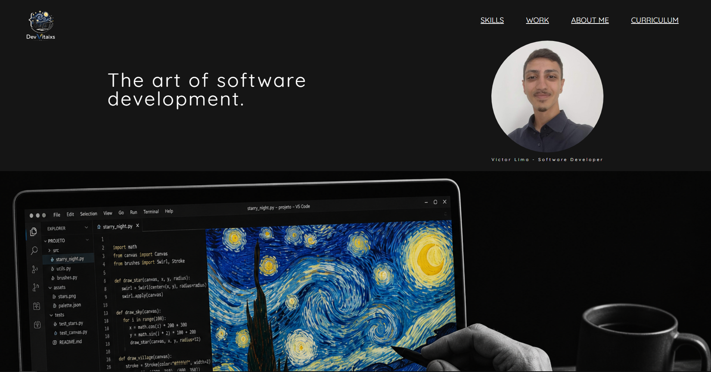

# 💻 Portfólio — Victor Coutinho De Lima Martins (RA2581392523036)

Um portfólio pessoal com foco em **desenvolvimento de software**, unindo visual artístico inspirado em *Obras de Van Gogh* com uma referencia moderna de tecnologia.

---

## 🚀 Sobre o projeto

Esse projeto é um site de portfólio responsivo criado pra apresentar:

* Skills e ferramentas
* Projetos desenvolvidos
* Informações pessoais
* Contatos e redes sociais

A ideia foi misturar **arte + código**, trazendo uma identidade visual diferente do padrão de desenvolvedores e demonstrando o foco em experiencia do usuário.

---

## 🎨 Conceito visual

O design segue uma linha de:

* 🌑 Dark mode dominante
* 🎨 Elementos inspirados em arte clássica
* 💻 Referências diretas ao mundo dev (código, layout limpo, grids)
* ✨ Interações suaves (hover + smooth scroll)

---

## 🛠️ Tecnologias utilizadas

* HTML5
* CSS3
* Google Fonts
* Font Awesome
* Devicon

---

## 📁 Estrutura do projeto

```
📦 repositório
 ┣ 📂 docs
 ┃ ┣ 📂 assets
 ┃ ┃ ┗📜 imagens (logos, background, icons)
 ┃ ┣ 📜 index.html
 ┃ ┗ 📜 style.css
 ┗ 📜 README.md
```

---

## ⚙️ Funcionalidades

* ✅ Navegação
* ✅ Layout
* ✅ Grid de projetos com efeito hover
* ✅ Menu com navegação por seções
* ✅ Informações de contato

---

## 🧠 Seções do site

* **Wellcome** → Define a identidade do portifólio
* **Skills** → Tecnologias e ferramentas
* **Work** → Projetos (grid interativo)
* **About** → Sobre o autor
* **Footer** → Direitos e infos

---

## 📸 Preview

<p align="center">
  
</p>

---

## 👨‍💻 Autor

Victor Lima - Desenvolvedor Full Stack em Formação

---
